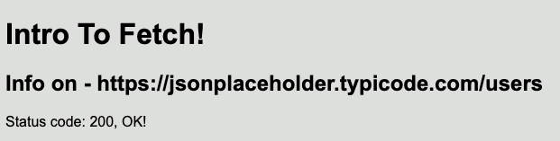
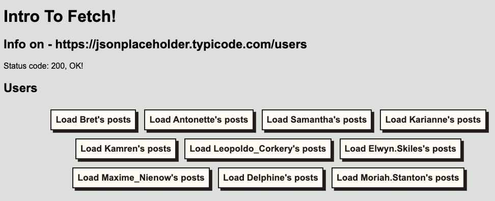

# Fetch

- [Overview](#overview)
- [Setup](#setup)
  - [Submitting On Time](#submitting-on-time)
  - [playground.js](#playgroundjs)
  - [npm test](#npm-test)
- [async/await vs .then](#asyncawait-vs-then)
- [Section 1 - Fetching the data](#section-1---fetching-the-data)
  - [Question 1 - checkResponseStatus](#question-1---checkresponsestatus)
  - [Question 2 - getUsers](#question-2---getusers)
  - [Question 3 - getUserPosts](#question-3---getuserposts)
  - [Question 4 - createNewUser](#question-4---createnewuser)
- [Section 2 - Rendering functions](#section-2---rendering-functions)
  - [Question 5a - renderStatus](#question-5a---renderstatus)
  - [Question 5b - Invoke renderStatus](#question-5b---invoke-renderstatus)
  - [Question 6a - renderUsers](#question-6a---renderusers)
  - [Question 6b - Invoke renderUsers](#question-6b---invoke-renderusers)
  - [Question 7a - renderPosts](#question-7a---renderposts)
  - [Question 7b - Invoke renderPosts](#question-7b---invoke-renderposts)
  - [Question 8a - renderNewUser](#question-8a---rendernewuser)
  - [Question 8b - Invoke renderNewUser](#question-8b---invoke-rendernewuser)
  - [Testing API Calls](#testing-api-calls)

## Overview

In this assignment we're going to use the free, open source, practice API https://jsonplaceholder.typicode.com. We're going to use the users and posts endpoints to list users, list a users posts, and then create a (fake) new user! We'll also practice rendering our results. Remember, the general structure of fetching data looks like this:

```js
// 1. Invoke fetch with an API endpoint. A promise is returned.
const fetchPromise = fetch('API_ENDPOINT_GOES_HERE');

// 2. Define promise handlers with .then and .catch
fetchPromise
  .then((response) => {
    // 3. Check that the response is ok. If it isn't throw a useful error.
    if (!response.ok) {
      throw Error(`Fetch failed. ${response.status} ${response.statusText}`)
    }

    // 4. Start reading the response body's ReadableStream
    const readingPromise = response.json();
    return readingPromise
  })
  .then((responseBody) => {
    // 5. When the response body is read, do something with it!
    // What you do will depend on the API you're using
    // TIP: Print the structure of the body to see what you're working with.
    console.log(responseBody);
  })
  .catch((err) => {
    // 6. Handle Errors
    console.error(err);
  })
```

## Setup

For guidance on setting up and submitting this assignment, refer to the Marcy lab School Docs How-To guide for [Working with Short Response and Coding Assignments](https://marcylabschool.gitbook.io/marcy-lab-school-docs/fullstack-curriculum/how-tos/working-with-assignments#how-to-work-on-assignments).

After cloning your repository, make sure to run the following commands:

```sh
npm i
git checkout -b draft
npm t
```

For this assignment, we're using a Vite project! So run the command:

```bash
npm run dev
```

That will start Vite's dev server which will automatically update your page any time you save your files.

### Submitting On Time

You have to understand that "grades" don't exist at Marcy. We only need performance data in order to know how you're doing, and make sure the people who need help get it as quickly as they can. It's ok if you didn't finish by the deadline! Just show us what you have. We'll have office hours and reviews, and we want to know what you are all struggling with so we can use those meetings effectively. **This is not about grades, its about seeing what you know, and where we can help!**

### playground.js

The most straightforward way to test your code is to test your code by hand as you work. Invoke your functions and use `console.log()` to print out the results. Then, `cd` into the `src/` directory and use the `node <file_name>` command to run your JavaScript files. 

You can also create what's called a "playground" (or "sandbox") file where you import any code you need, and then mess around with that file. We've included one in the `src` directory so you can see it. Run that program using `node src/playground.js`.

### npm test

Before submitting your code, make sure you got things right by running the provided automated tests.

You can do this using the commands:

```sh
npm test ## run the automated tests
npm run test:w ## run the automated tests and rerun them each time you save a change
```

You will know that you have "completed" an assignment once you have passed 75% or more of the automated tests!

## async/await vs .then
We know you may know how to use `async/await` syntax already, but we're going to use `.then` syntax for this assignment. Why? Because we want you to understand promises deeply, and also why we invented better syntax! We'll be using `async/await` in the next assignment, so don't worry, you'll get to practice that too.

## Section 1 - Fetching the data

In this assignment we're going to use the free, open source, practice API https://jsonplaceholder.typicode.com. We're going to use the users and posts endpoints to list users, list a users posts, and then create a (fake) new user! We'll also practice rendering our results.

First things first, we need to fetch our data. We'll do this in the functions found in `src/fetch-functions.js`. These are all imported into `src/main.js` where we are logging the results of these functions. Notice that each function returns a Promise so we are using `.then()` calls to print out their resolved values. Uncomment these function calls as you test them.

```js
checkResponseStatus()
  .then((statusInfo) => {
    console.log('status:', statusInfo)
  });
```

To see the output of these `console.log` statements, run the project's Vite server and view the console:

```
npm run dev
```

Complete the functions in `fetch-functions.js` and you can test these functions specifically with this command:

```
# run tests just for this one file
npm t tests/fetch-functions.spec.js

# or just run all of the tests
npm t
```


### Question 1 - checkResponseStatus

At the top of the file you can see the variable:

```js
const userUrl = 'https://jsonplaceholder.typicode.com/users'
```

Use this URL to send an HTTP request and get the users data. However, we don't care about the data (yet). For now, we just want to get the details of the `response` object. Here are the details of this function:

- Parameters: None
- API endpoint: https://jsonplaceholder.typicode.com/users
- Output:
  - A promise containing the fetch `response`'s `status`, `ok`, and `url` properties in an Object. So, something like this (not with those exact values):
    ```js
    // A Promise that resolves to an object
    Promise {
      {
        status: 200,
        ok: true,
        url: https://jsonplaceholder.typicode.com/users
      }
    }
    ```

The overall shape of your code should resemble this.

```js
const getValueFromThen = () => {
  // this function return's the promise created by .then
  return asyncFunction().then(data => {
    // this 'value' is what .then()'s promise resolves to 
    return 'value';
  });
}
```
* Remember that `.then()` also returns a promise. This function should return the Promise that `.then()` returns.
* Remember to return from inside the `.then()` callback. The returned `.then` promise resolves to whatever its callback returns.


### Question 2 - getUsers

Now, this time we ARE going to get and return the user data. Remember, the response body is a `ReadableStream` which we need to read as JSON. See the example at the top of the assignment for the general structure of a fetch.

- Parameters: None
- API endpoint: https://jsonplaceholder.typicode.com/users
- Output:
  - A promise containing the array of fetched users

### Question 3 - getUserPosts

Now that we can fetch all of the users, let's learn about a single user. In this function, we're going to fetch data about a single user by their `userId` value. Write a function that takes in a `userId` and gets their posts.

- Parameters:
  - `userId`: a number identifying a user
  - `maxNumPosts`: the number of posts to fetch from that user (default to 3 if not provided)
- API endpoint: https://jsonplaceholder.typicode.com/users/{userId}/posts
- Output:
  - A promise containing an array of posts that belong to the given user, as identified by their id number. There are LOTS of posts, but you must limit the number by `maxNumPosts`, with a default value of 3.

### Question 4 - createNewUser

And finally, we've sent fetch requests to GET data about users. Now, let's send a fetch request to create (POST) a new user. Check out the notes for [how to send a fetch request with the POST verb](https://marcylabschool.gitbook.io/marcy-lab-school-docs/fullstack-curriculum/mod-3-async/2-fetch#kinds-of-requests-http-verbs).

For this API, after sending the request to create a new user, the response body will contain the new user you just created. 

Send the request to create a new user AND return the user object provided by the API in the response body.

- Parameters:
  - `newUserData`: an object containing a `username` and `email` property, both strings
- API endpoint: https://jsonplaceholder.typicode.com/users
  - HTTP Method: `"POST"`
- Output:
  - A promise containing the new `user` object from the response body. The object should contain the given `username` and `email` properties AND the `id` assigned to the user by the API. 

NOTE: Since this API isn't really saving our data, the id provided for the new user will always be the same. If you were using a real API, it would be different for each user.


## Section 2 - Rendering functions
Once you get your data, you actually have to use it. Now, there are 2 steps: first you need to make the rendering functions, and **then** you need to use them. So, for each of these questions, you will first write a rendering function in `render-functions` and then you will invoke it in `main.js`! This separation of concerns will keep our code nice and organized.

**You may need to review some of your DOM manipulation methods, that's alright!**

### Question 5a - renderStatus

The first fetching function you wrote, `checkResponseStatus`, sends a fetch and returns the `url`, `status`, and `ok` properties of the response. This function, `renderStatus`, should render that status information inside of the `div#status` element!

- Inputs:
  - `statusDiv`: This will be the `div#status` element, this is what the function will modify
  - `responseStatusObj`: an object with `url`, `status`, and `ok` properties (the data from `checkResponseStatus`)

- This function should add the following content to the provided `statusDiv`:
  - An `h2` tag
    - This will have an `id` of `'status-heading'` and text content of "Info on - [url]"
  - A `p` tag
    - This will have an `id` of `'status-code'`
    - The text content depending on the `status` and `ok` properties of the `responseStatus`. Here are some examples:
      - Status code: 200, OK!
      - Status code: 201, OK!
      - Status code: 500, FAIL!
      - Status code: 404, FAIL!
    - The template looks like this:
      - "Status code: [status code], [if `ok` is true then print 'OK', otherwise 'FAIL']"

The resulting HTML should look like this:

```html
<!-- This is an example output -->
<div>
  <h2 id="status-heading">Info on - https://jsonplaceholder.typicode.com/users</h2>
  <p id="status-code">Status code: 404, FAIL!</p>
</div>
```

### Question 5b - Invoke renderStatus

Now that you have the two helpers `checkResponseStatus()` and `renderStatus()` written, let's put them together!

At the top of the `main()` function in `main.js`, the variable `statusDiv` has been created for you to grab the `div#status` element. 

We're going to take the data returned from `checkResponseData` and render it inside of that `statusDiv` using the `renderStatus` function.

Here's what you should do:
* In `main.js`, invoke `checkResponseStatus()` to start the fetching process.
* Use `.then` to schedule a callback so that we can handle when the promise returned by `checkResponseStatus` resolves.
* When the promise resolves, invoke `renderStatus` with the provided `statusDiv` and the response status data as inputs.

Hints:

Remember, you can use the `.then()` function to schedule a callback to execute when a promise resolves:

```js
asyncFunction()
  .then((resolvedValue) => {
    doSomethingWithData(resolvedValue);
  });
```

When you're done, you should see this when you run your Vite development server:

;

### Question 6a - renderUsers

The second fetching function you wrote, `getUsers()`, fetches an array of users. This function should render those users as list items in the `ul#users-list` element.

- Inputs:
  - `usersUl`: This will be the `ul#users-list` element to which we will add list items for each user
  - `users`: an `array` of `user` objects, each will have a LOT of properties from the API, but the only ones we care about for this function are `username` and `id`

- For each user in `users`, this function should create a new `li` element and add it to the given `usersUl`. Each `li` element should have:
  - A `button` with the text content `"Load [username]'s posts"`. 
  - The `button` should also have a `data-user-id` attribute equal to the current user's `id` 

The resulting HTML should look something like this:

```html
<!-- for users [{ username: 'Bret', id: 1 }, { username: 'Joan', id: 2 }], the created html li should be -->
<ul id="users-list">
  <li class="user-card">
    <button data-user-id="1">Load Bret's posts</button>
  </li>
  <li class="user-card">
    <button data-user-id="2">Load Joan's posts</button>
  </li>
<ul>
```

- Don't forget the `data-user-id` attribute (`dataset.userId`). It should correspond to each user's user id.


### Question 6b - Invoke renderUsers

Now that you have the two helpers `getUsers()` and `renderUsers()` written, let's put them together!

At the top of the `main()` function in `main.js`, the variable `usersUl` has been created for you to grab the `ul#users-list` element. 

We're going to take the data from `getUsers` and render it inside of that `usersUl` using the `renderUsers` function.

Here's what you should do:
* In `main.js`, invoke `getUsers()` to start the fetching process.
* Use `.then` to schedule a callback so that we can handle when the promise returned by `getUsers` resolves.
* When the promise resolves, invoke `renderUsers` with the provided `usersUl` and the array of users.

When you're done, you should see this when you run your Vite development server:



### Question 7a - renderPosts

The third fetching function, `getUserPosts`, fetches the posts for a single user. This function should render those posts as list items in the `ul#posts-list` element.

- Inputs:
  - `postsUl`: an `HTMLElement` of a `ul` that this function will add `li`s to, one for each post
  - `posts`: an array of `post` (as in "blog posts") objects, each one will have an `id`, `title`, and `body` attribute.

- For each post in `posts`, this function should create a new `li` element and add it to the given `postsUl`. Each `li` element should have:
  - An `h2` with the text content of the post's `title`
  - An `p` with the text content of the post's `body`
- Additionally, each time the function is called, all previous list items held by `postsUl` should be removed. You can do this easily by setting `innerHTML = ''`.

The resulting HTML should look something like this:

```html
<ul id="users-list">
  <li>
    <h2>My title 1</h2>
    <p> lorem ipsum...</p>
  </li>
  <li>
    <h2>My title 2</h2>
    <p> lorem ipsum...</p>
  </li>
<ul>
```

Note: all the titles and bodies of the api are fake latin gibberish.

### Question 7b - Invoke renderPosts

Rendering posts is going to be a little different than rendering the status and rendering users. Both of those pieces of data were rendered immediately. 

The posts of a single user, however, should only be rendered when one of the user buttons is clicked. Each time a different user button is clicked, the posts for that user should be fetched with `getUsersPosts` and then rendered in the `ul#posts-list` using `renderPosts`.

Here's what you should do:
1.  In `main.js` set up an event listener to track clicks on the user buttons in the `ul#users-list`. 
  * How can you use delegation to minimize the number of event listeners?
2. Get the `data-user-id` value from the button that was clicked and then invoke `getUserPosts` using that user id. 
3. When `getUserPosts` resolves to the fetched posts, invoke `renderPosts`, providing the `postsUl` element and the fetched posts as inputs.

Note: The tests are grouped by file so each "B" step where you are working in `main.js` will have a corresponding test found in `main.spec.js`.

### Question 8a - renderNewUser

The final fetching function, `createNewUser`, sends a POST request to create a new user and receives that user back. This function should render the details of the newly created user in the `div#new-user` element.

- Inputs
  - `newUserDiv`: an `HTMLElement` of a `div` that we will mutate and add our `newUserInfo`
  - `newUserInfo`: an object with at least a `username` and `email` property, both are strings

This function is real simple! No arrays, just mutate the div to have an `h2` and `p` tag, no id's necessary.

```html
<!-- for a user {username: 'chuck12', email: 'chuck@gamil.com'} -->
<h2>chuck12</h2>
<p>chuck@gmail.com</p>
```


**innerHTML vs nodes**:
So this is a crucial question: can you just set the `innerHTML` or do you need to create isolated nodes one by one? The answer is: can you trust the data? If you *know* the data isn't user generated (like status codes) then `innerHTML` is ok, but if you're ever entering text that *could've* come from a user, use nodes for safety. No malicious JS is going to sneak into our pages!


### Question 8b - Invoke renderNewUser

For this last one, you are challenged to think through how to put together your fetching and rendering code. In the end, you should have the following functionality:

- When we submit the form, we should send a POST request to the JSON Placeholder API to create a new user. We'll get back a user object.
- After submitting the form, we should then see the username and email appear on the screen below in the area under the form (see the `div#new-user` element)
- After submitting the form, the form clears itself
- We can fill out the form as many times as we like, and the new user section will only show the latest user

### Testing API Calls

A quick note about the tests. We're faking our network calls with a library called `nock`. You don't make real network calls in tests, that's unreliable and slow. Unfortunately, `nock` gives pretty garbage error messages. `nock` will fail your test if you try to make a request for a route we haven't faked. Make *sure* each fetch function only fetches *once* and the url is exactly correct, ok?

Also, if you want to console log things in your tests, don't forget to scroll up in the terminal to see the log output!
